# Proyecto #3

## Colaboradoras :

Yenny Castillo
Diana 
Yanina Portal

##Social Network

Las redes sociales han venido a cambiar la forma como las personas nos comunicamos , permitiendo una comunicación más directa y rápida  a esto se le suma el costo mucho  menor de anunciarse comparado con las medios de comunicación tradicionales ,como son : la radio , la television , etc.

La principal función de las Redes Sociales es la de relacionar personas a través de las herramientas que ofrecen y todas comparten las mismas características : 

* Crear un perfil.
* Compartir contenido.
* Generar listas de contactos.

### Algunos datos estadisticos.

Se menciona a continuación algunos datos estadisticos , donde se pone en evidencia su masivo uso.

* 84% de los usuarios de internet acceden a las redes sociales.
* 27% del tiempo en internet lo utilizan en las redes sociales.
* 74% de los usarios de redes sociales, piensan que éstas son un medio de confianza al que acudir cuando se quiere tomar una decisión sobre la compra de un producto o servicio.
* 60% de los consumidores interactúa con, al menos, una marca en las redes sociales.

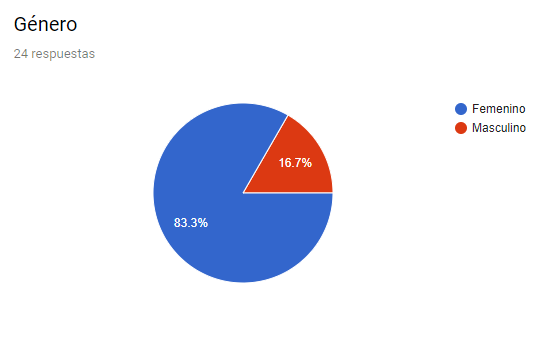
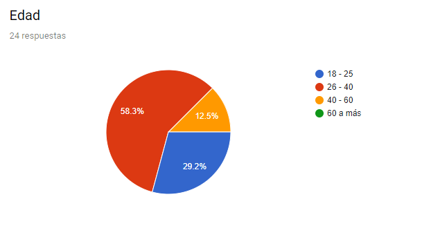
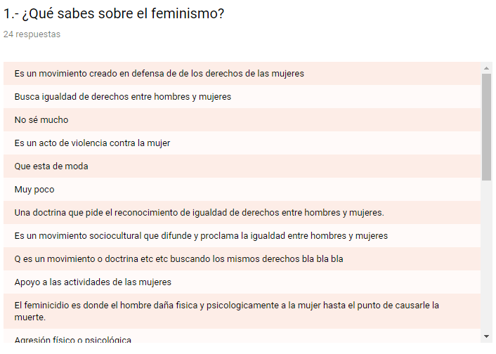
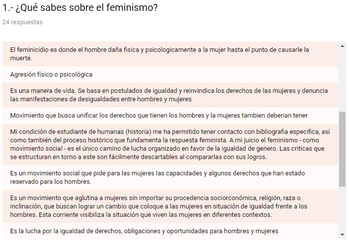
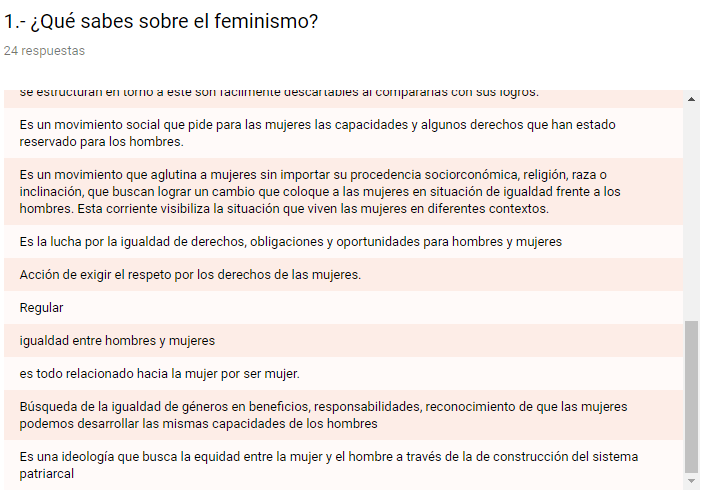
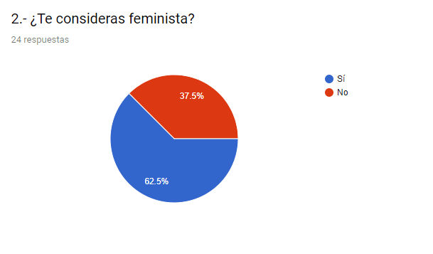
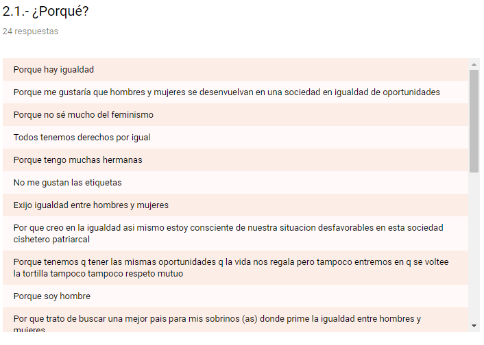
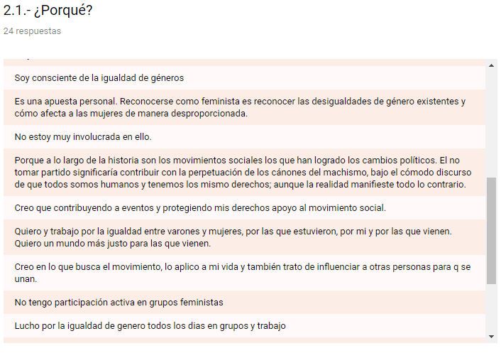
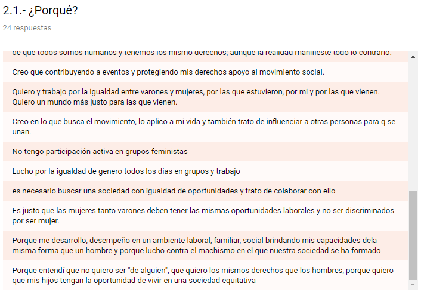
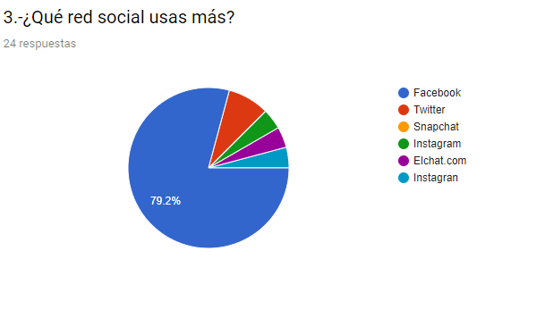
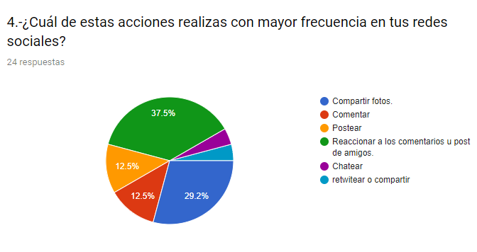
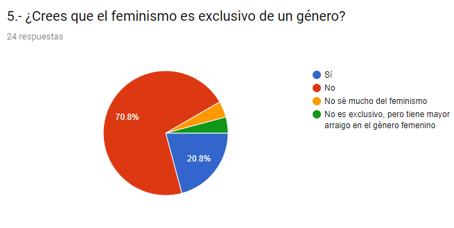
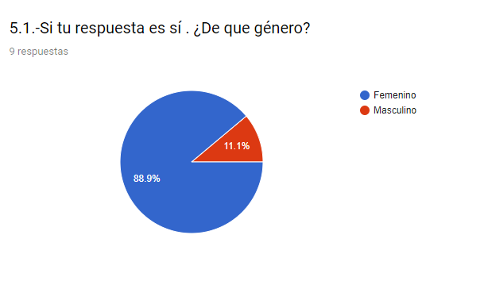
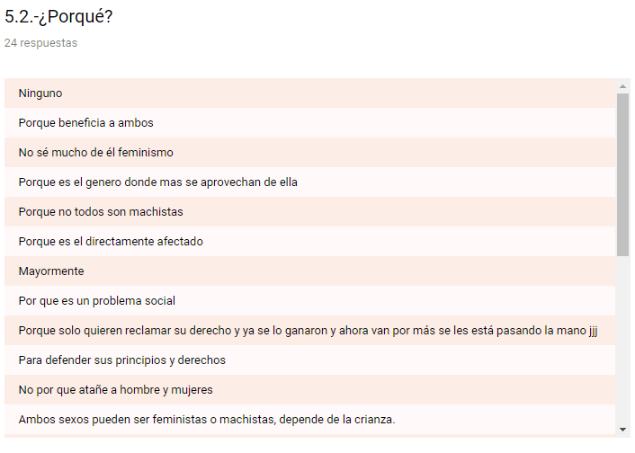
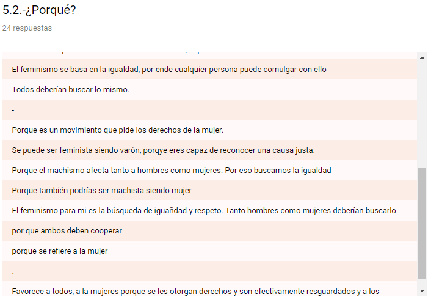
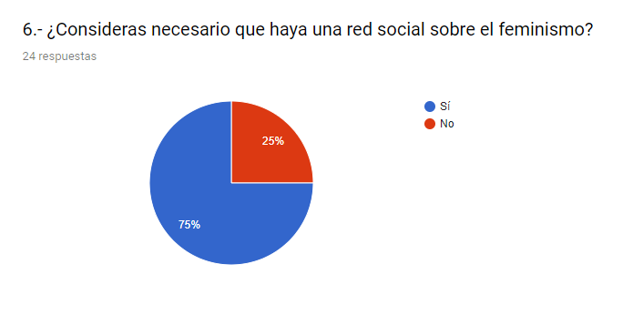
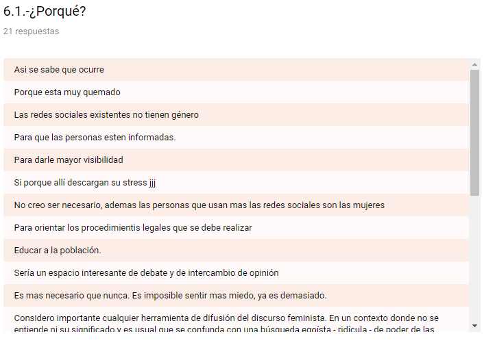
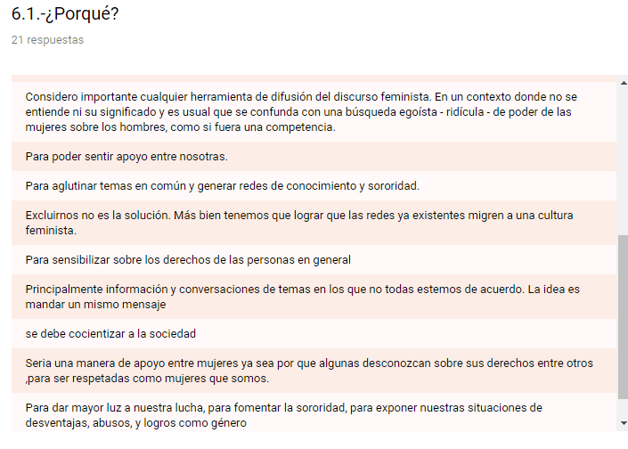
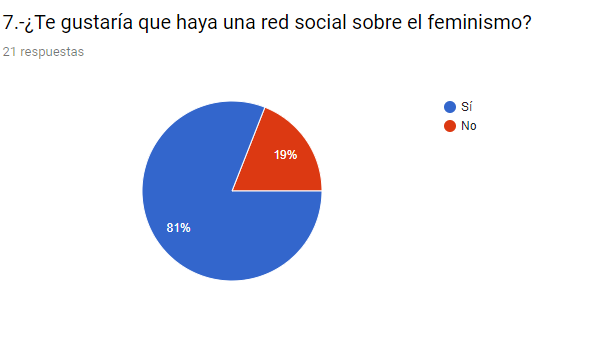
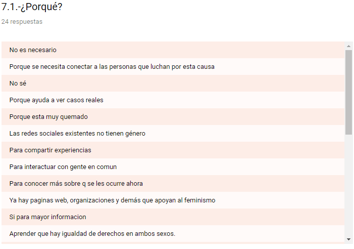
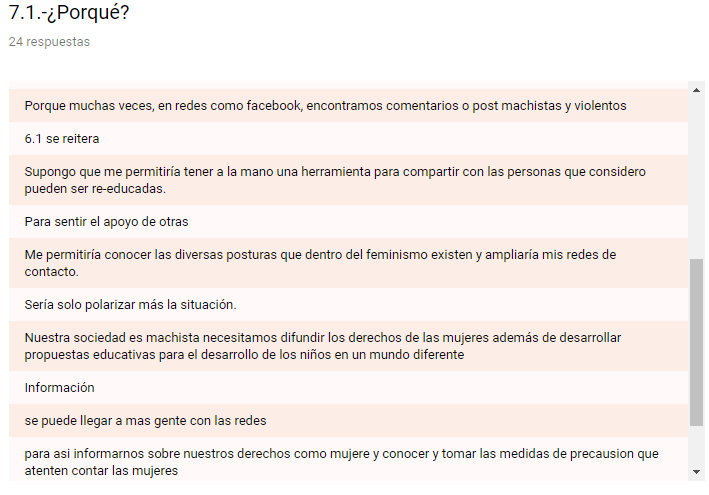
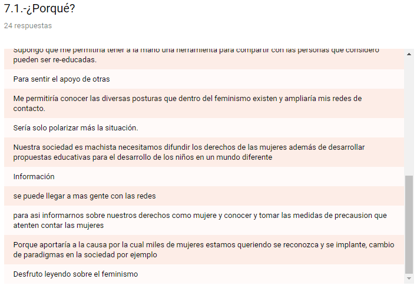
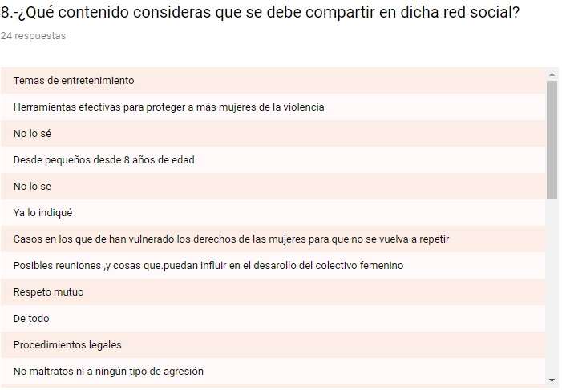
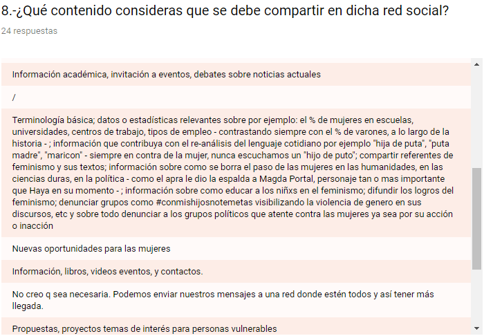
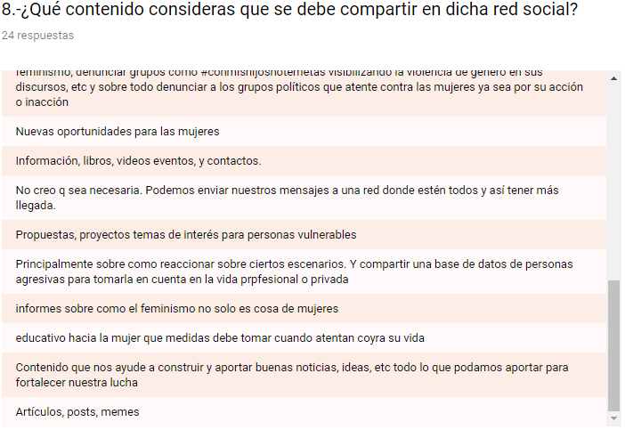
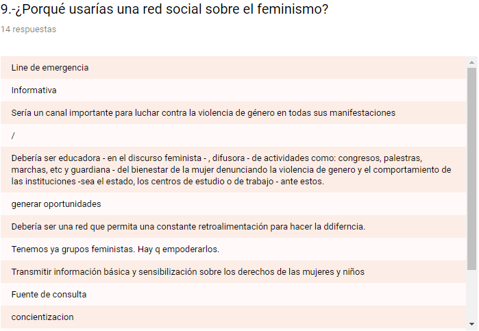
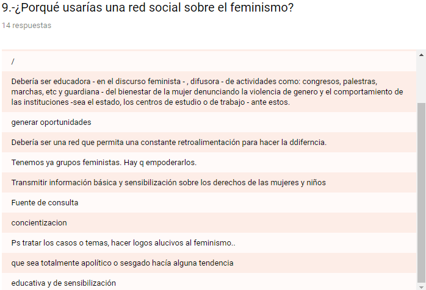

