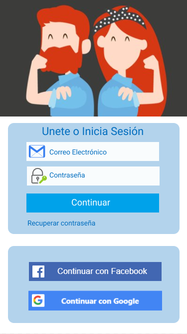

# Proyecto #3

## SPRINT #1

# Red Social ¡Soy Feminista!

  

## Preámbulo

  

En la actualidad existen diferentes redes sociales como: Instagram, Snapchat, Twitter, Facebook, etc. que nos permite comunicarnos y entretenernos, convirtiéndolas así en un medio más fácil y rápido para compartir y recibir información a nivel global, llegando a crear niveles de dependencia en la vida del ser humano y en su ámbito social.

Es así que las redes sociales toman un lugar predominante en nuestras vidas, ya que nos permite relacionarnos a todo nivel y pueden ser utilizada por cualquier persona, inclusive las pequeñas y grandes empresas han aprovechado estos medios para llegar a nuevos clientes.

  

## Introducción

  

Hoy en día la población relaciona a la corriente feminista con la idea de que las mujeres se quiere igualar a los hombres y que es una corriente solo para mujeres, nada más alejado de la realidad, lo que nos demuestra que hay mucha desinformación a nivel general tanto en la población femenina como en la masculina. Es así que viendo esta necesidad de información y viendo la oportunidad de comunicación que nos ofrecen las redes sociales surge la idea de crear una red social de feministas que nos permita informar a la población sobre esta corriente(feminismo) que no es exclusiva solo de mujeres si no que por el contrario también tiene entre sus miembros a muchos hombres que creen firmemente en el principio fundamental del Feminismo: "La Igualdad de Derechos".

  

## User Experience Design

  

### Definición del producto

¡Soy Feminista! es una Red Social dirigida a la población Feminista (mujeres y hombres) y a aquellas personas que necesiten informarse sobre esta corriente llamada "Feminismo", donde podrás compartir información concerniente a esta corriente, compartir comentarios, postear fotos,  etc.

¡Soy Feminista! te permite conectarte con otras personas y se puede abrir en cualquier dispositivo web desde un móvil hasta una laptop, lo que la hace de fácil acceso para nuestros usuarios.

  

## Objetivos

  

El objetivo principal de crear esta red social es cubrir la necesidad de información que existe en la población con respecto al Feminismo.

  

Objetivos Específicos :

  

* Crear una red social que sea de fácil acceso a nuestros usuarios.

* Permitir a los usuarios registrarse a nuestra red social usando sus cuentas de otras redes (faceboock, google, etc.)

* Permitir a los usuarios postear, subir fotos, agregar publicaciones.

* Permitir a los usuarios agregar, editar y eliminar contenido de la red social.

  

Para conocer y diseñar la experiencia de nuestros usuarios hicimos una encuesta en la que nos permitió recolectar valiosa información para la toma de decisiones en la creación y contenido de nuestra red social, información que reflejamos en nuestro sketch.

  

## Encuesta dirigida a nuestro público objetivo.

Formulario de la encuesta :

Con la encuesta se concluye que:
  

* El 30% de los encuestados , tiene una idea equivocada dell feminismo.

* El 20% de los encuestados , no conoce el significado del feminismo.

* Del 100% de mujeres encuestadas, el 30% no conoce el significado de feminismo y tampoco se considera feminista.

  

* Del 100% de hombres encuestados el 75% no conoce el significado de Feminismo y ven al feminismo como una amenaza.

  

* Del 100% de encuestados el 71% considera que el Feminismo es una corriente exclusiva de las mujeres.

  

* Del 100% de encuestados el 75% considera que debería de existir una red social que trate el tema del Feminismo.

  

* La mayoría de los encuestados manifiestan que le gustaría que en ésta red social se compartiera información que permita conocer mejor este movimiento feminista, que además se muestre los logros obtenidos por mujeres que muchas veces pasan de manera anónima, y éstas a su vez sean inspiración para quienes siguen esta red social.

  

## Entrevista dirigida a nuestro público objetivo

Esta entrevista tuvo como objetivo conocer que Lema representaba mejor al Feminismo para tomarla como lema de nuestra red social.

Frases propuestas:

Total de entrevistados: 45 personas.

1.- Cuando todos seamos iguales todos seremos más libres (21).

  

2.- No queremos poder sobre los hombres sino sobre nosotras mismas (6).

  

3.-No estoy aceptando las cosas que puedo cambiar, estoy cambiando las cosas que no puedo aceptar (7).

  

4.-No buscamos la igualdad, buscamos la liberación de la mujer, la igualdad es la consecuencia de ello (2).

  

5.-Cuando estamos en silencio somos una y cuando hablamos somos todas (7).

  

6.- El futuro es Femenino (2).

  
Con la entrevista se concluye que:

  

* El 47 % considera que la frase n° 1 representa mejor esta corriente, concluyendo la mayoría que esta frase es inclusiva porque unifica a todos los géneros.

  

* El 16% considera que las frases n° 3 y n° 5 representa mejor esta corriente.

## Prototipo de Baja Fidelidad 

## Prototipo de Baja Fidelidad - Versión Mobile
 

## Prototipo de Baja Fidelidad - Versión Desktop

## Psicología del color.

Los colores forman parte de nuestra vida , tanto que son los encargados de transmitir emociones y que varíe nuestro estado de ánimo.
No solo influencia en los sentimientos , sino tambien en las acciones de las personas impulsando a realizar alguna acción o dejando de hacerla ; a permanecer en una página web motivandote a conocer más de ella , realizando una acción concreta dentro de la página web  o simplemente cerrarla por no encontrarle coherencia entre lo que pretende transmitir y lo que ofrece.

Cada color va unido a uno o varios sentimientos y viceversa , a cada uno de los sentimientos podemos aplicarle un color.

Basado en ello , elegimos el color azul con el que se asocia calma , seriedad , fortaleza , confianza , tranquilidad ; emociones que queremos que transmitir ya que es un tema que origina discrepancias debido a una percepción errónea que algunos tienen por la poca información que hay o a grupos radicales que desvirtuan el real objetivo del feminismo que es la igualdad y no la supremacia de un género.

Pero más allá de la psicología del básica del color , algunos estudios han demostrado que el género afecta las preferencias en cuanto a colores de las personas y el color azul es un color que coincidimos amnbos géneros en su agrado , por ello de su elección como color principal , ya que nuestro objetivo es que tanto hombres como mujeres sean parte de nuestra red social y derribar esa percepción errónea que el feminismo se asocie con un solo género.

El color gris transmite confianza, profesionalismo emociones que queremos transmitir ya que hay grupos extremistas que pretenden desvituar el real objetivo del feminismo , mediante la desinformación .

Elegimos como logo el simbolo del hombre y la mujer , interceptado con un símbolo de igualdad porque resume la verdadera razón de ser del feminismo , la lucha por la igualdad de género . 

## Prototipo de Alta Fidelidad

  ## Figma

  

## Marvel

[Link del Prototipo](https://marvelapp.com/3bb83fe)

## BENCHMARK DE LAS PRINCIPALES REDES SOCIALES.

  

Considerando que las redes sociales nos permiten llegar a cualquier parte del mundo y por tanto teniendo como objetivo principal la creación de una red social intentamos analizar a nuestra competencia no solo a nivel local si no también a nivel global que nos permita tener una visión clara de como direccionara nuestra red social.

  

## COMPETENCIA DIRECTA

  

### Redes sociales a nivel Global

  

### Time's Up Now

Esta cuenta de Instagram tiene su origen en en el movimiento homónimo creado en 2006 para luchar contra el abuso sexual contra las mujeres. A día de hoy ha vuelto a ganar importancia debido, entre otras noticias, al apoyo de actrices como Jennifer Lawrence, Reese Whiterspoon, Cate Blanchett o Emma Stone, que han firmado el manifiesto para luchar también contra la desigualdad de la mujer.
* Seguidores: 654K

  

### Global Fund Women

Esta cuenta de Instagram pertenece a una organización del mismo nombre que invierte su tiempo y sus fondos en los movimientos de las mujeres. Apoyan a todas las personas que se involucran de una manera activa en los grupos feministas. Su filosofía es clara: "Las mujeres son las mejores agentes en sus comunidades locales y hay que darles recursos y voz para que puedan cambiar el mundo".
* Seguidores: 64.2K
  

### Makers

Lanzada en 2012, esta plataforma trata de entrevistar a todas aquellas mujeres pioneras de hoy y de mañana, según explican en su web. Hasta hoy han producido más de 4.500 vídeos a través de sus 400 productores. Entre los vídeos más destacados destacan los realizados a figuras del feminismo como Lena Dunham, Oprah Winfrey, Shonda Rhimes o, a pioneras como la primera árbitro de la NBA o Violet Palmer, la primera corredora de la Maratón de Boston.
* Seguidores: 140K
  

### Redes sociales a nivel Local

  

### Movimiento Feminista Del Perú.

Es una plataforma dirigida a todo público sin distinción de género.

* Seguidores: 8002

* Plataforma de exposición: Facebook

 * Publico objetivo: Todos sin distinción de género.

  

### Comando Feminista

Es un espacio de articulación de colectivas feministas jóvenes para la rebeldía contrasexual y anti patriarcal

 * Seguidores: 3589

* Plataforma de exposición: Facebook

* Publico objetivo: Mujeres

  

### Las Respondonas

Es una plataforma virtual que nace con la intención de darle voz a las mujeres.

* Seguidores: 10665

* Plataforma de exposición: Facebook

* Publico objetivo: Mujeres

  

### Ni Una Menos Perú

Tocan a una tocan a todas, es una consigna que dio nombre a un movimiento feminista y un colectivo de protesta contra la violencia hacia las mujeres y su consecuencia más grave y visible.

* Seguidores: 161570

*  Plataforma de exposición: Facebook

* Publico objetivo: Mujeres

  

## COMPETENCIA INDIRECTA

  

  

## CONCLUSIONES DEL BENCHMARK

Actualmente existen muchos movimientos que tiene como bandera al Feminismo y todos nacieron con la finalidad de informar y empoderar a las mujeres, usando como medio a las diferentes redes sociales existentes, siendo la más usada Facebook y Twitter, teniendo como público objetivo en su mayoría solo al sexo femenino.

  

Con esta información podemos concluir:

1.- No existe una Red Social que toque el tema del Feminismo.

2.- Los Movimientos Feministas al usar plataformas como Facebook y twiter limitan su funcionalidad.

3.- Al ser la primera red social Feminista serviremos de plataforma para todxs estxs movimientos.

4.- Seremos la primera red social que considere a todxs los géneros como su público objetivo, tomando ésto en cuenta para el diseño de nuestra red social.

  
## ENTREVISTA

 Preguntas formuladas en la entrevista :

> 1.- Cuéntame que sabes sobre el feminismo.

> 2.-¿Crees que esta corriente es exclusiva de un genero?.

> 3.- ¿Porqué? 

> 4.- ¿Crees  que es necesario difundir esta corriente ? 

> 5.-¿Porqué?

> 6.-¿Cómo lo difundirías?

> 7.-¿Conoces alguna red social o un blog que toque este tema?.

> 8.-¿Cómo lo descubriste o como llegaste a ella?

> 9.- Si existiera una red social que tenga como bandera el feminismo  :
> * ¿Qué  contenido te gustaría que tenga?
> * ¿Cuando  utilizarías la red?
> * ¿Qué te gustaría que te permita hacer esta red social? 
> * ¿Qué te frustraría al usar esta red social?
> * ¿Qué beneficio crees que aportaría a tu vida y a la sociedad ?
> 

> 10.-Recomendaciones para el uso de esta red social.

  

## CONCLUSIONES

Nuestrxs entrevistadxs manifestaron:

* Que existen redes sociales que les permiten comunicarse a nivel global, pero aún no existe una Red Social que tome al Feminismo como bandera.

* Consideran que sería ideal que existiera una Red Social Feminista que agrupe a todos los movimientos Feministas en una sola red.

* Que les gustaría que esta red Social sea inclusiva y agrupe a personas de todos los géneros , no solo de manera implícita sino de una manera explícita.

* Que esta Red Social sea un medio informativo para la población donde se comparta información relevante de esta corriente para cubrir esa gran brecha de desinformación existente en la actualidad, además que esta información contenga los links que los redireccione a la fuente de origen de la información compartida.

* Que esta Red Social les permita :

   * Hacer y eliminar publicaciones.
   * Postear
  * Chatear
  * Subir fotos
  * Tener notificaciones de eventos específicos.
  
 * Que esta Red Social comparta el contenido siguiente:

      * Historia sobre el Feminismo.
      * Vocabulario Feminista (terminología general).
      * Historias de mujeres que trascendieron en el tiempo, que sirvan de inspiración.
      * Eventos, marchas, reuniones de activismo.
      * Noticias, artículos, testimonios, etc.

  ## TEST DE PROTOTIPOS DE LA RED SOCIAL.

  
 Se presentaron  3 prototipos a lxs entrevistadxs .

 ## Prototipo #1 

[Link del Primer Prototipo ](https://marvelapp.com/41fi692)

 ## Prototipo #2

[Link del Segundo Prototipo ](https://marvelapp.com/32i460c)

 ## Prototipo #3

[Link del Tercer Prototipo ](https://marvelapp.com/413539a)

Se testearon 3 prototipos con los usuarios, recibiendo diferentes feedback tanto en los colores como la distribución de las imágenes.
Al testearlos observamos en nuestros usuarios lo sgte:

   * Les incomodaba el Loading por el tiempo de espera.
   * Las imágenes no les hacían alusión al tema.
   * La combinación de colores no les atraía.
   * La ubicación de los botones los confundía.

Revisando estos puntos, tomando en cuenta las observaciones y sugerencias hechas por nuestros usuarios concluimos en el siguiente prototipo tratando de consolidar todos los aportes obtenidos a través del test.
   
   ## Prototipo Elegido

[Link del Prototipo Elegido ](https://marvelapp.com/5d8dg11)

